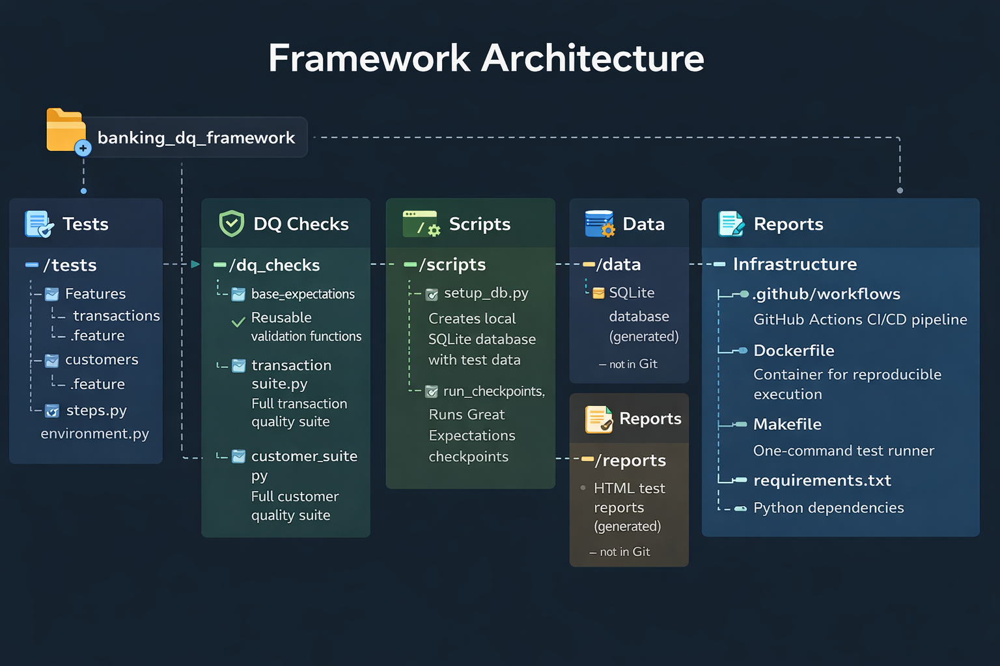
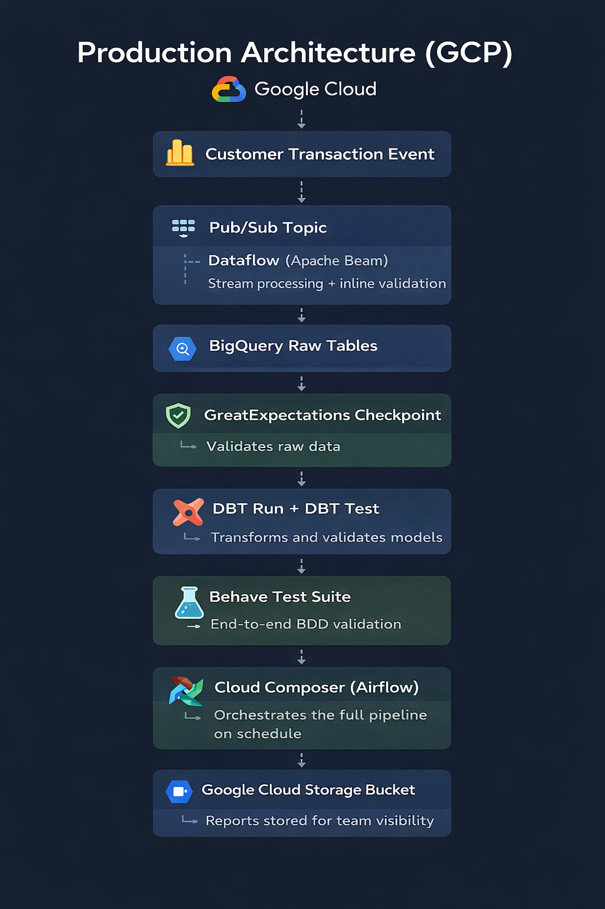

# Banking Data Quality Framework
### GCP Banking Data Platform
#### Built with: Python · GreatExpectations · dbt · Behave (BDD) · SQLite · GitHub Actions

---

## Overview

This framework demonstrates a production-grade data quality testing suite
built for a cloud-based banking data platform. It validates two core banking
tables, **transactions** and **customers**, using a layered testing approach:

- **Behave (BDD)** : plain-English test scenarios readable by engineers
  and business stakeholders alike
- **GreatExpectations** : automated data validation at the raw data layer
- **dbt** : transformation layer testing with schema contracts
- **GitHub Actions** : CI/CD pipeline that runs all tests on every push

The framework is designed to mirror the architecture of a real GCP-based
banking data platform, where data flows from event sources (Pub/Sub/Kafka)
into BigQuery, and quality must be enforced at every layer before data
is consumed by downstream models or customer-facing systems.

---

## Data Quality Checks Implemented

### Transactions table
| Check | Type | Expected Result |
|-------|------|----------------|
| transaction_id not null | Null check | PASS |
| transaction_id unique | Duplicate detection | FAIL — T001 appears twice |
| amount between 0.01 and 1,000,000 | Range check | FAIL — T007 has -50.00 |
| customer_id exists in customers | Referential integrity | FAIL — C999 has no match |
| transaction_type is DEBIT or CREDIT | Accepted values | PASS |
| currency is GBP | Accepted values | PASS |

### Customers table
| Check | Type | Expected Result |
|-------|------|----------------|
| customer_id not null | Null check | PASS |
| customer_id unique | Duplicate detection | PASS |
| credit_score between 500 and 999 | Range check | FAIL — C005 has score 455 |
| account_type is CURRENT or SAVINGS | Accepted values | PASS |

The deliberately bad data rows prove the framework catches real issues,
a quality framework that only runs on clean data is not a quality framework.

---

## Framework Architecture


---

## How to Run

### Option 1 — Local (Python)
```bash
# 1. Clone the repository
git clone https://github.com/officialHW/banking-dq-framework.git
cd banking-dq-framework

# 2. Install dependencies
pip install -r requirements.txt

# 3. Create the test database
python scripts/setup_db.py

# 4. Run the full test suite
behave tests/features/ -v
```

> Tested on macOS. Works on Linux with identical commands.
> Windows users: use Option 2 (Docker) for guaranteed compatibility,
> or replace `python` with `python3` if needed.

---

## Test Results
```
2 features passed, 0 failed, 0 skipped
12 scenarios passed, 0 failed, 0 skipped
43 steps passed, 0 failed, 0 skipped
```

### Deliberately bad data detected
- T001 duplicate transaction ID : correctly detected
- T007 negative amount (-£50.00) : correctly detected
- C999 orphaned transaction (no matching customer) : correctly detected
- C005 invalid credit score (455, below minimum 500) : correctly detected

---

## Tool Choices and Rationale

### Why Behave (BDD)?
BDD makes data quality requirements readable by both engineers and
business stakeholders. In a regulated banking environment, compliance
teams and product owners need to understand what quality rules are being
enforced, not just engineers. The `.feature` files serve as living
documentation that non-technical reviewers can read and verify.

Behave was chosen over Cucumber because the framework is Python-based.
Both use identical Gherkin syntax, Cucumber is the Java equivalent.

Alternative considered: pure pytest : simpler setup but loses the
plain-English readability layer that BDD provides. For a banking data
platform where business stakeholders need to audit quality rules,
BDD format is the stronger choice.

### Why GreatExpectations?
GreatExpectations operates at the raw data layer, before any
transformation, catching quality issues at source. It connects
natively to BigQuery, running expectations as SQL queries within the
warehouse rather than loading data into memory. This makes it suitable
for production-scale banking datasets with billions of rows.

Alternative considered: Soda Core, similar concept, slightly different
syntax. GreatExpectations was chosen for its richer HTML reporting
(Data Docs) and native BigQuery and Cloud Storage integration.

### Why dbt?
dbt handles the transformation layer, building clean models from raw
data and running schema tests on every model output. It provides lineage
tracking and auto-generated documentation, essential in a team environment.

The combination of GE (raw layer) and dbt (transformation layer) gives
defence in depth, bad data is caught at source AND after transformation.
If only one layer catches a problem, it is still caught.

### Why SQLite for local testing?
SQLite is file-based, needs no server or credentials, and makes the
framework instantly executable by anyone with Python installed. The
database connection is abstracted so swapping SQLite for BigQuery
requires one configuration change, everything else stays identical.

---


## Production Architecture (GCP)

In a production GCP environment this framework runs as follows:


```

---

## CI/CD

GitHub Actions runs the full test suite automatically on every push
to the main branch. The workflow installs all dependencies, runs dbt,
runs GreatExpectations checkpoints, and runs the full Behave suite.
Results are visible on the Actions tab. Reports are saved as
downloadable artifacts so the team can review quality status without
running anything locally.

---

## Credentials and Security

No credentials are stored in this repository. The local SQLite database
is generated at runtime by `scripts/setup_db.py` and is excluded from
Git via `.gitignore`. For GCP deployment, credentials are passed via
environment variables or GitHub Secrets — never hardcoded in source code.

---

## Author
Henry Williams — Data Engineer and Quality Specialist
GitHub: [@officialHW](https://github.com/officialHW)